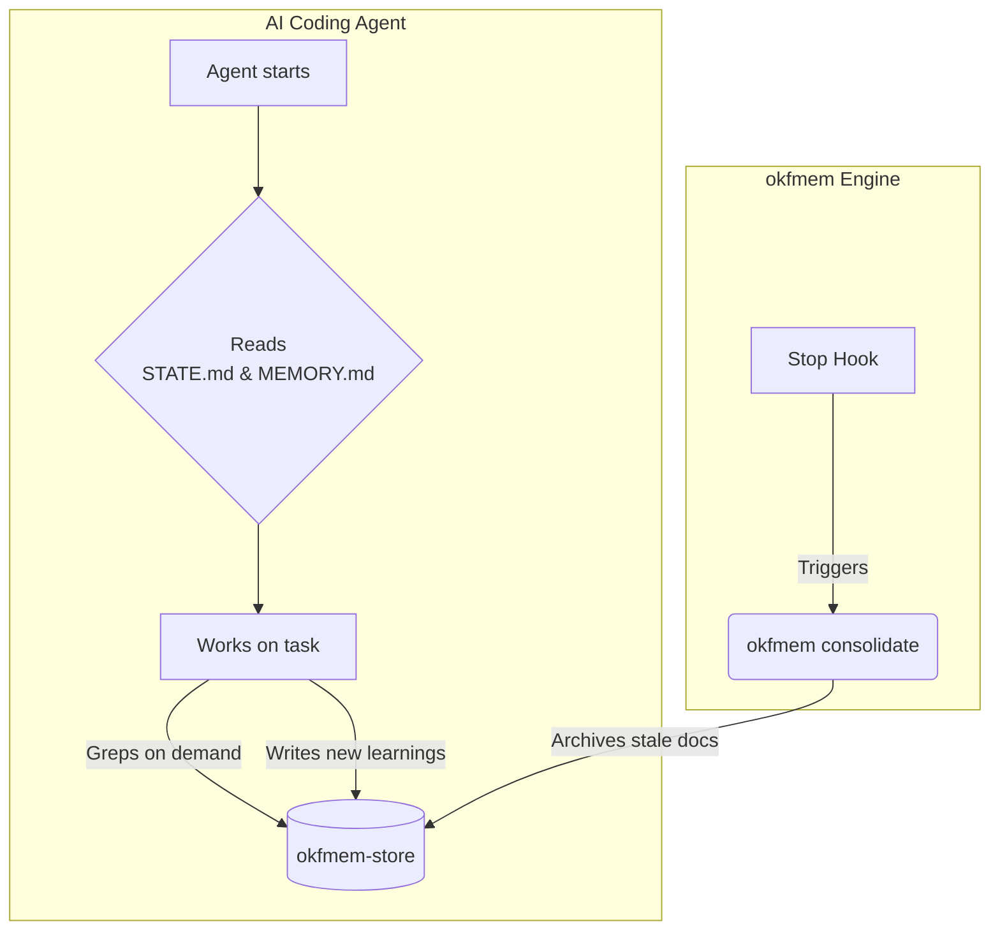

# okfmem — self-maintaining OKF markdown memory engine

<p align="center">
  
</p>

## Quickstart

Requirements: Python 3 (stdlib only — no dependencies) and `git`. Runs natively on macOS, Linux, and Windows.

```bash
# 1. Clone the engine (this repo)
git clone https://github.com/s-annam/okfmem.git ~/okfmem
cd ~/okfmem

# 2. Run the automated installer
./install.sh
```

**On Windows**, run the native PowerShell installer instead:

```powershell
git clone https://github.com/s-annam/okfmem.git $env:USERPROFILE\okfmem
cd $env:USERPROFILE\okfmem
powershell -ExecutionPolicy Bypass -File install.ps1
```

(WSL or Git Bash also work fine with `./install.sh` if you prefer a POSIX shell — `install.sh` detects a native `cmd`/PowerShell context and points you at `install.ps1` instead of limping through with missing primitives.)

The installer will:
1. Symlink the `okfmem` CLI to `~/.local/bin/okfmem`.
2. Create a local git-backed store at `~/okfmem-store` (if it doesn't exist).
3. Wire the memory system into your AI coding agents (Claude Code, Antigravity, etc.).
4. Optionally link a private GitHub remote for the store. If you already have an
   `okfmem-store` repo (a returning user, or a second machine), it offers to link
   and **pull it down**; otherwise it offers to create one. Skip it to stay
   local-only — you can add a remote later with `git -C ~/okfmem-store remote add origin <url>`.

Make sure `~/.local/bin` is in your `$PATH`. (e.g., `export PATH="$HOME/.local/bin:$PATH"`).

### Uninstalling

```bash
./uninstall.sh
```

**On Windows:**

```powershell
powershell -ExecutionPolicy Bypass -File uninstall.ps1
```

This removes the `okfmem` CLI wrapper(s) and every okfmem-managed harness wiring
step install/init created — pointer blocks, skill links, per-project memory
links, and the Stop/SessionStart hooks — leaving anything it didn't create
untouched. **All memory data is kept by default.** It also offers two opt-in
steps, both off unless you say yes: delinking the store's GitHub remote
(`git remote remove origin` — the store and its history stay on disk), and
fully deleting the store's data, which requires a `[y/N]` confirmation
*followed by* typing the exact store path (or `DELETE`) — a bare `-Force`/`-y`
can never trigger it. Both destructive prompts are skipped automatically (with
the equivalent manual command printed) on a non-interactive/piped run.

Preview everything first with `--dry-run` (`-DryRun` on Windows): it removes no
wrapper, runs the unwire step in dry-run, and describes the two opt-in prompts
instead of showing them — no state is changed.

```bash
./uninstall.sh --dry-run
```

### Updating

The engine is a git clone, so updating it is one command — same on every OS:

```bash
okfmem update          # git pull --ff-only the engine, then re-run init
okfmem update --check  # report whether a newer version exists; change nothing
```

`okfmem status` also prints a passive nudge when your clone is behind (checked at
most once a day, and never over a pipe or from the Stop hook). Updates are
fast-forward only: if you've made local engine commits that diverge from origin,
the pull refuses rather than clobbering them — stash or branch first.

## Why okfmem

I didn't set out to build this. I wanted to use an existing memory system, and for
months I did — I ran one such third-party system as the store, keeping my own tooling
deliberately thin: a set of wrapper skills to save memory as I worked and read it back
at the start of a new session. The goal was to lean on a third-party engine and not
maintain my own.

It worked well, but it was slow, and nothing ever decayed — the automatic
forgetting layer was a phase I never got working on top of it, so I hand-cleaned
constantly. It was also complex: a background daemon pushed my memory to git on a
timer, and during a migration a leftover copy on a *second* machine fired at the
wrong moment — a blind `git add -A && commit && push` that propagated an
18,435-line deletion across every project onto the branch all my machines share.
Claude recovered it with `git merge -s ours` (keep the known-good local tree, no
force-push). But the complexity had shown itself: the architecture I'd adopted to
avoid building wasn't buying safety, it *was* the risk.

Even then I tried not to build. I re-surveyed the space — it has genuinely filled in,
and the serious options now do decay and consolidation well — but every one I found is
DB/engine-backed, with markdown as an *export* rather than the source of truth. I wanted
the inverse, so I built the smallest thing that does it.

**The Problem:** Native agent memory (e.g. Claude Code auto-loading a `MEMORY.md` index) has no lifecycle management. Pages only accumulate, so the index grows into an endless scratchpad and the signal gets buried mid-context ("Lost in the Middle"). DB-backed frameworks fix this with tiered memory, but they lean on their own local databases and stay coupled to their ecosystem — your markdown is only ever an export.

**The Solution:** `okfmem` brings a self-maintaining memory architecture to your existing CLI agents without a database. By sitting on top of native features (like Claude Code's file reading), it adds mathematical decay, Open Knowledge Format (OKF) metadata, and automatic archival to keep your agent's context window lean. It also provides an opt-in SQLite full-text search index over your past sessions—but safely isolated as a rebuildable, git-ignored local cache.

Storage uses [Google's Open Knowledge Format (OKF) v0.1][okf] — one markdown page per topic, YAML frontmatter, plain-markdown links. No database, no server.

> A page read 3× survives ~3× longer; the always-loaded index stays ≤200 lines. Decay does the forgetting so the signal never gets buried mid-context.

## Architecture: Engine ⇄ Store Split

Just like `chezmoi` separates the tool from your dotfiles, `okfmem` separates the engine from your private data.

| Repo | Role | Contents |
|---|---|---|
| **`okfmem`** (this repo) | The **Engine** (Public) | The scripts and CLI (`memory_*.py`, `okfmem`) |
| **`<user>/okfmem-store`** | The **Store** (Private) | Your data: `projects/*/`, `archive/`, `MEMORY.md`, `STATE.md` |

By keeping them separate, your data never leaves your machine unless you push it to a private repo.

## How It Compares

The usual objection is "how is this different from just writing markdown files?" — the answer is lifecycle. okfmem keeps plain markdown as the *source of truth* while adding the decay and archival that raw files lack, and it does so with no database and no daemon.

| | Source of truth | Daemon? | Database? | Cross-harness? | Decay / archival? |
|---|---|---|---|---|---|
| **okfmem** | plain OKF markdown in git | no (session-end hook) | no | yes (Claude Code + Antigravity) | yes (Ebbinghaus, never deletes) |
| Claude Code native memory | markdown | no | no | no (Claude Code only) | no (grows unbounded) |
| DB-backed memory frameworks | SQLite / vector (markdown = export) | typically | yes | varies | yes |

Every DB-backed alternative treats markdown as an export, not the store. okfmem's premise is the inverse: the markdown *is* the store, readable by any agent with `grep`.

## How the AI Uses It (Daily Flow)

Once installed, the memory system works transparently with your AI agent.

### 1. Auto-Loading Context (Start of Session)
When the AI starts, it automatically reads two files per project:
*   **`STATE.md` (Active State):** A bounded snapshot of current work, priorities, and context. Overwritten every session.
*   **`MEMORY.md` (Durable Knowledge):** A 200-line index of one-line pointers to deeper knowledge.

### 2. On-Demand Retrieval (During Session)
If the AI needs more context, it `grep`s the durable `<slug>.md` pages referenced in `MEMORY.md`.

### 3. Capture & Sync (End of Session)
The AI is instructed to capture insights into new `<slug>.md` pages and update `STATE.md` before the session ends. 

## How the Engine Maintains It

The `okfmem` CLI handles maintenance so your AI doesn't have to. 

### 1. Decay & Graceful Archival (`okfmem consolidate`)
To prevent context bloat, the system automatically tracks page accesses. If a page isn't read, it decays.
*   **Never Delete:** Stale pages are moved to `archive/`. They are never permanently deleted, ensuring zero data loss.
*   **Math:** Retention `R = exp(-t_days / S)` where `S = access_count + 1`. Pages with `R < 0.40` and age `> 14d` are safely archived.

**Wiring the Stop hook (Automated Archival):**
To run consolidation automatically when your agent finishes a session, add this to your agent's configuration (e.g., `~/.claude/settings.json`):
```json
{ "hooks": { "Stop": [ { "hooks": [ {
  "type": "command",
  "command": "python3 ~/okfmem/memory_consolidate.py --stdin-hook"
} ] } ] } }
```
**On Windows**, use `python` (or `py`) and an absolute path — `~` isn't
expanded the way it is in a POSIX shell — e.g.:
```json
{ "hooks": { "Stop": [ { "hooks": [ {
  "type": "command",
  "command": "python C:\\Users\\<you>\\okfmem\\memory_consolidate.py --stdin-hook"
} ] } ] } }
```
`install.ps1` prints this snippet with your actual resolved path at the end of installation.

**Statusline save-state badge (optional):**
The same Stop hook writes a one-token save-state to `${CLAUDE_CONFIG_DIR:-~/.claude}/.okfmem-status` each turn, so your statusline can show an ambient reminder instead of relying on you to remember `/okfmem-save`:

*   `okfmem*` (amber, trailing `*`) — you did work this session (an edit, a commit) that isn't captured yet. Glance at it before you `/clear`. The `*` mirrors git's dirty marker.
*   `okfmem` (green, no `*`) — captured this session.
*   *(nothing)* — no work to capture, or opted out.

**The installer offers to wire it** (`[y/N]`), or run it anytime:
```bash
okfmem init --wire-statusline
```
It sets your Claude Code `statusLine` to the badge **only when you have none** — an existing/custom statusline is never clobbered; instead it prints a guarded compose snippet to paste in (mirrors how a caveman-style badge is delegated). The badge scripts (`okfmem-statusline.sh`, and `okfmem-statusline.ps1` for PowerShell) are keystroke-cheap (one small file read, no `git`/`python`) and refuse a symlinked flag. The hook also drops a git-ignored `.session-trail.md` in the store (cwd + files touched) so a *forgotten* save still leaves a same-machine trail. Opt the whole thing out with `OKFMEM_NO_STATUS=1`.

### 2. Initialization & Wiring (`okfmem init`)
Scans your system for supported harnesses (Claude Code, Antigravity) and writes a managed `<!-- MEMORY-POINTER v1 -->` block into their global prompts so the AI knows where to find the memory. (The `install.sh` script runs this automatically).

### 3. Backfill Metadata (`okfmem backfill`)
An idempotent tool that stamps required YAML frontmatter (like `importance`, `pinned`, `created`) onto all durable pages. (The `install.sh` script runs this automatically).

### 4. Status Check (`okfmem status`)
Run this anytime to view the wiring status, detected harnesses, and if your store has any uncommitted changes.

### 5. Session Search (`okfmem search`)
An opt-in plugin that builds a local SQLite FTS5 index over your agent's past conversation transcripts (e.g., Claude Code or Antigravity logs). This allows your agent to perform deep full-text searches across historical sessions to recover details not currently in `MEMORY.md`. The `.db` is purely a derived local cache—gitignored and rebuildable anytime via `okfmem index`.



## Store Location Override

By default, the store is created at `~/okfmem-store`. To put it elsewhere, set `$OKFMEM_STORE` in your shell profile or pass `--store PATH` to any command.

---
Design & research: the full design, decay math, prior-art survey, and phased plan
live in the tracked issues — [#1](https://github.com/s-annam/okfmem/issues/1)
(self-maintaining memory) and [#2](https://github.com/s-annam/okfmem/issues/2)
(session search). See [`CONTRIBUTING.md`](CONTRIBUTING.md) to get involved.

[okf]: https://github.com/GoogleCloudPlatform/knowledge-catalog/blob/main/okf/SPEC.md
[memgpt]: https://arxiv.org/abs/2310.08560
[lost-in-the-middle]: https://arxiv.org/abs/2307.03172
[generative-agents]: https://arxiv.org/abs/2304.03442
