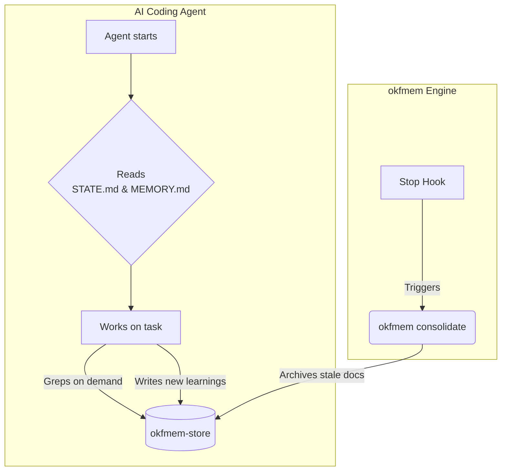

# okfmem — self-maintaining OKF markdown memory engine

**The Problem:** AI coding agents suffer from amnesia between sessions and get bloated if they read too much context.
**The Solution:** A plain-markdown, git-portable memory system that auto-loads a tiny index, retrieves details on demand, and automatically decays stale information.

Storage uses [Google's Open Knowledge Format (OKF) v0.1][okf] — one markdown page per topic, YAML frontmatter, plain-markdown links. No database, no server.

## Architecture: Engine ⇄ Store Split

Just like `chezmoi` separates the tool from your dotfiles, `okfmem` separates the engine from your private data.

| Repo | Role | Contents |
|---|---|---|
| **`okfmem`** (this repo) | The **Engine** (Public) | The scripts and CLI (`memory_*.py`, `okfmem`) |
| **`<user>/okfmem-store`** | The **Store** (Private) | Your data: `projects/*/`, `archive/`, `MEMORY.md`, `STATE.md` |

By keeping them separate, your data never leaves your machine unless you push it to a private repo.

## Quickstart

Requirements: Python 3 (stdlib only — no dependencies) and `git`. Runs on macOS and Windows.

```bash
# 1. Clone the engine (this repo)
git clone https://github.com/s-annam/okfmem.git ~/okfmem
cd ~/okfmem

# 2. Run the automated installer
./install.sh
```

The installer will:
1. Symlink the `okfmem` CLI to `~/.local/bin/okfmem`.
2. Create a local git-backed store at `~/okfmem-store` (if it doesn't exist).
3. Wire the memory system into your AI coding agents (Claude Code, Antigravity, etc.).

Make sure `~/.local/bin` is in your `$PATH`. (e.g., `export PATH="$HOME/.local/bin:$PATH"`).

## How the AI Uses It (Daily Flow)

Once installed, the memory system works transparently with your AI agent.

### 1. Auto-Loading Context (Start of Session)
When the AI starts, it automatically reads two files per project:
*   **`STATE.md` (Active State):** A bounded snapshot of current work, priorities, and context. Overwritten every session.
*   **`MEMORY.md` (Durable Knowledge):** A 200-line index of one-line pointers to deeper knowledge.

### 2. On-Demand Retrieval (During Session)
If the AI needs more context, it `grep`s the durable `<slug>.md` pages referenced in `MEMORY.md`.

### 3. Capture & Sync (End of Session)
The AI is instructed to capture insights into new `<slug>.md` pages and update `STATE.md` before the session ends. 

## How the Engine Maintains It

The `okfmem` CLI handles maintenance so your AI doesn't have to. 

### 1. Decay & Graceful Archival (`okfmem consolidate`)
To prevent context bloat, the system automatically tracks page accesses. If a page isn't read, it decays.
*   **Never Delete:** Stale pages are moved to `archive/`. They are never permanently deleted, ensuring zero data loss.
*   **Math:** Retention `R = exp(-t_days / S)` where `S = access_count + 1`. Pages with `R < 0.40` and age `> 14d` are safely archived.

**Wiring the Stop hook (Automated Archival):**
To run consolidation automatically when your agent finishes a session, add this to your agent's configuration (e.g., `~/.claude/settings.json`):
```json
{ "hooks": { "Stop": [ { "hooks": [ {
  "type": "command",
  "command": "python3 ~/okfmem/memory_consolidate.py --stdin-hook"
} ] } ] } }
```

### 2. Initialization & Wiring (`okfmem init`)
Scans your system for supported harnesses (Claude Code, Antigravity) and writes a managed `<!-- MEMORY-POINTER v1 -->` block into their global prompts so the AI knows where to find the memory. (The `install.sh` script runs this automatically).

### 3. Backfill Metadata (`okfmem backfill`)
An idempotent tool that stamps required YAML frontmatter (like `importance`, `pinned`, `created`) onto all durable pages. (The `install.sh` script runs this automatically).

### 4. Status Check (`okfmem status`)
Run this anytime to view the wiring status, detected harnesses, and if your store has any uncommitted changes.



## Store Location Override

By default, the store is created at `~/okfmem-store`. To put it elsewhere, set `$OKFMEM_STORE` in your shell profile or pass `--store PATH` to any command.

---
Design & research: `okfmem-store/design/memory-v2-self-maintaining-design.md` and [s-annam/tools#19].

[okf]: https://github.com/GoogleCloudPlatform/knowledge-catalog/blob/main/okf/SPEC.md
[s-annam/tools#19]: https://github.com/s-annam/tools/issues/19
